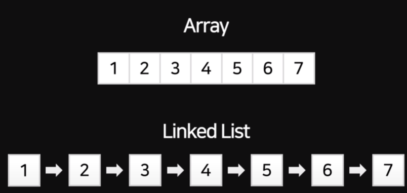

# 주제 : 데이터베이스 탐색 알고리즘 탐구 및 분석을 통한 상황 및 특징별 최적의 알고리즘 선택

학번 : 20430  
이름 : 진태호	


# 서론  
  ## (1) 주제 선정 동기  
현대 사회에서 IT 산업은 가장 핵심이 되는 기술 중 하나이다. 우리는 매일 스마트폰과 컴퓨터를 사용하며 다양한 앱 또는 웹 등 대부분의 작업을 그러한 IT 기술을 적극적으로 활용하고 있다. 그러한 시스템과 서비스에는 유저의 정보를 저장하거나, 서비스의 현재 상태를 보관하거나, 실시간으로 변경되는 정보를 저장해둔 뒤, 수정과 삭제 및 반환이 가능한 기술 스택이 존재할 것이다. 우리는 그러한 기술을 데이터베이스(DB) 라고 명명했으며, 다양한 IT 기술 스택 중에서도 데이터베이스 기술은 대부분의 서버, 시스템, 서비스의 기반을 다지고, 구축하는 데에 필수적으로 사용되며, 웹 및 앱 등 정형화된 정보를 저장하는 서비스는 모두 데이터베이스 시스템에 의존하고 있다고 볼 수 있다. 이러한 요소들을 바탕으로, 데이터베이스 기술은 현대 사회에서 매우 중요한 역할을 수행하고 있다.  

- 특히, 실제 개발과 서비스에서 가장 많이 사용하는 데이터베이스 구조에는 관계형 데이터베이스(RDBMS) 시스템을 주로 사용한다. 관계형 데이터베이스 시스템은 열과 행의 테이블을 사용하여 데이터를 저장하고 관리하는 방식이다. 그러나 이러한 관계형 데이터베이스 시스템에서는 데이터를 검색하고 처리하는 속도와 최적화가 매우 중요하다. 즉, 본 문서와 탐구에서 진행할 이진 탐색과 두 가지 트리 구조 에서 데이터를 탐색하는 알고리즘의 구성은 데이터베이스 시스템의 성능과 효율성에 큰 영향을 미친다.  

 - 따라서, 이 문서에서는 데이터베이스 시스템의 성능과 효율성을 향상시키기 위해 개발된 이진 탐색 알고리즘 외의 B-트리 알고리즘과, B+트리 알고리즘에 대해 비교하고 분석함으로써, 특정 상황이나 각각의 탐색 과정의 특징 별 데이터베이스 탐색의 효율성과 성능을 평가하고자 한다. 이를 통해 최적화된 검색 알고리즘을 선택하고 적용함으로써 데이터베이스 시스템의 성능을 최대한으로 끌어올리는 방법을 탐구하는 것이 목표이다.  
위의 동기를 바탕으로, 본 문서는 데이터베이스 시스템의 중요성과 최적화된 검색 알고리즘의 필요성을 강조하며, 다양한 최적화 기법을 비교 분석하여 실제 환경에서의 성능과 효율성을 평가하는 과정을 설명하려 한다.  

 - 또한, 이진 탐색 알고리즘의 경우, 해당 알고리즘을 통해 데이터베이스 내에서 특정한 값을 찾는 데에 소요되는 시간 복잡도를 로그 함수를 사용해 O(log n) 로 나타낼 수 있다. 이에 착안하여, 나머지 B-트리 알고리즘과, B+트리 알고리즘은 각각 시간 복잡도를 어떻게 나타낼 수 있으며, 추가로 공간 복잡도는 어떠한 수식으로 나타낼 수 있는가에 대해서도 탐구해보려 한다.

  ## (2) 탐구 목적  
 - 이 문서의 목적은 다양한 데이터베이스 검색 알고리즘에 대해 조사하고, 이들을 비교하여 상황에 맞는 다양한 탐색 알고리즘을 선택하는 것이다. 또한, 이 문서를 통해 데이터베이스 시스템의 성능 향상을 위한 알고리즘 기법에 대한 이해를 높이고, 실제 데이터베이스 환경에서 어떠한 알고리즘 기법을 사용해야 가장 효율적인지에 대해 탐구한다.
```
		- DB 시스템의 원리 탐구

		- 각 알고리즘별 시,공간 복잡도 및 특성 파악

		- 실제 코드 작성을 통한 데이터베이스 탐색 알고리즘 구현

		- 구현된 알고리즘 기반, 결과 도출

		- 결과를 통해 각각의 탐색 방식 별 장/단점과 사용처 및 선택 기준 정립
```
		
- 결론 및 피드백. 마무리


# 2. 본론
 ## (1) 배경이론 탐구
1.  DB 시스템의 원리 탐구
	데이터베이스란?: 조직 또는 개인이 관리하고 활용하는 데이터의 집합. 데이터베이스는 구조화된 데이터를 저장하고, 검색하고, 수정하고, 삭제하는 기능을 제공하여 정보를 효율적으로 관리할 수 있다. 데이터베이스는 데이터 모델을 사용하여 데이터의 구조를 표현한다. 가장 일반적으로 사용되는 데이터 모델은 관계형 데이터 모델이다. 이 모델은 테이블 형태로 데이터를 구성하고, 관계를 통해 데이터를 연결한다. 다른 데이터 모델로는 계층형 데이터 모델, 네트워크 데이터 모델, 객체 지향 데이터 모델 등이 있다. 데이터베이스는 스키마(schema)와 인스턴스(instance)로 구성된다. 스키마는 데이터베이스의 구조와 제약 조건을 정의하는 것으로, 테이블의 열과 데이터 타입, 관계 등을 정의한다. 인스턴스는 스키마에 따라 실제로 저장된 데이터의 집합을 의미한다. 데이터베이스에 접근하고 데이터를 검색, 수정, 삭제하는 작업은 쿼리 언어를 사용하여 수행된다. SQL(Structured Query Language)은 가장 널리 사용되는 쿼리 언어로, 관계형 데이터베이스에서 사용된다. 그리고, 데이터베이스의 성능을 향상시키기 위해 인덱스를 사용할 수 있다. 인덱스는 특정 열 또는 열의 조합에 대해 데이터를 정렬하여 검색 속도를 높이는 자료 구조이다. 또한, 쿼리 최적화는 데이터베이스 시스템의 성능을 향상시키기 위해 쿼리 실행 계획을 최적화하는 과정이다. 쿼리 실행 계획은 쿼리를 수행하는 방법과 순서를 결정하는 것으로, 최적의 실행 계획을 선택하여 쿼리의 실행 속도를 향상시킬 수 있다

2. 이진 탐색 알고리즘의 이해
	이진 탐색 알고리즘이란?: 이진 탐색 알고리즘은 정렬된 리스트나 배열에서 특정 값을 빠르게 찾는 알고리즘이다. 이 알고리즘은 탐색 범위를 반으로 분할하면서 찾고자 하는 값을 찾는다.
이진 탐색 알고리즘의 과정은 다음과 같다:
    1.  탐색 범위의 시작점과 끝점을 설정한다.(보통 리스트의 처음과 끝으로 설정한다.)
    2.  탐색 범위의 중간 위치의 값을 확인한다.
    3.  중간 위치의 값과 찾고자 하는 값을 비교한다.
    4.  중간 위치의 값이 찾고자 하는 값과 일치하면 탐색을 종료한다.
    5.  중간 위치의 값이 찾고자 하는 값보다 크다면 탐색 범위를 중간 위치의 왼쪽 부분으로 좁힌다.
    6.  중간 위치의 값이 찾고자 하는 값보다 작다면 탐색 범위를 중간 위치의 오른쪽 부분으로 좁힌다.
    7.  탐색 범위가 더 이상 좁혀지지 않을 때까지 위의 과정을 반복한다.
해당 알고리즘은 탐색 범위를 반으로 줄이면서 탐색하므로 평균적으로 O(log n)의 시간 복잡도를 가진다. 이는 대량의 데이터에서도 효율적으로 동작할 수 있게 해 준다. 그러나, 이진 탐색 알고리즘을 사용하기 위해서는 탐색 대상이 알맞게 정렬된 상태여야 한다는 전제 조건이 있다.

 - (2) 탐구설계 과정
1. 모식도를 통한 이진 탐색 알고리즘, B-트리 알고리즘, B+트리 알고리즘 이해
2. 시간 복잡도와 공간 복잡도 및 기타 요소 표를 통한 성능 비교
3. 각 알고리즘의 특징 및 장단점 분석
4. 프로그래밍 언어를 활용한 각 알고리즘의 구현 및 시뮬레이션
5. 분석 결과를 바탕으로 적절한 상황 및 데이터 유형에 따른 알고리즘 선택 기준 도출
(3) 실험 경과
ⅰ) 모식도를 통한 이진 탐색 알고리즘, B-트리 알고리즘, B+트리 알고리즘 이해
먼저, 간단한 모식도를 통해 이진 탐색, B-트리, B+트리를 확인해본다  

  
해당 이미지는 이진 탐색 알고리즘을 그림으로 간단히 모식화한 것으로, 단순한 1차원 배열이며, 자료가 알맞은 순서대로 정렬되어있어야 하는 것을 볼 수 있다.  
  
해당 이미지는 B-트리 구조를 모식화한 그림으로, 이진 탐색 알고리즘과는 다르게 1차원 배열이 아니며, 흩뿌려뜨린 자료를 노드를 사용하여 브랜치로 연결한 것을 볼 수 있다. 이진 탐색 알고리즘처럼 정렬할 필요 없이, 적은 수의 탐색으로 효율적으로 원하는 자료를 찾을 수 있다.  
  
해당 이미지는 B-트리 구조를 발전시킨 B+트리 구조를 모식화한 그림이다. 기존의 트리 구조는 유지하되, 가장 아래 노드에만 데이터를 저장한 다음, 그 위의 노드에는 탐색 가이드라인을 제공해주는 방식이다. 또한, 최하단 노드끼리도 연결되어 있어, 범위 검색에 큰 이점을 보인다.  

2. 시간 복잡도와 공간 복잡도 및 기타 요소 표를 통한 성능 비교
다음은 시간 복잡도, 공간 복잡도, 팬아웃, 높이, 디스크 I/O, 캐시 효율성, 오버헤드 및 기타 사항으로 표를 작성한 것이다.
여기서 d는 각 노드가 가질 수 있는 최대 자식 노드 수를 뜻한다. 예를 들어, d=3인 B-트리에 대해서는 각 노드가 최대 3개의 자식 노드를 가질 수 있으며 최대 2개의 키 값을 저장할 수 있다. 또한, 수식이나 숫자로 표현되지 않는 값은 상대적인 값임을 미리 밝힌다.

| 알고리즘  | 시간 복잡도  | 공간 복잡도 | 팬아웃 |  높이  |  디스크 I/O | 캐시 효율성 | 오버헤드 | 기타 사항             |
|---------|------------|------------|------|-------|-----------|----------- |--------|--------------------- |
| 이진 탐색  | O(log n)   | O(1)        |  2    |  nil  |    nil     |   높음       |  낮음   | 정렬된 데이터에 접근    |
| B-트리    | O(log_d n) | O(n)        |  d   | O(log_d n) |  높음  |   낮음    | 높음  | 짧은 범위 조회, 동적 파일 시스템 |
| B+트리   | O(log_d n) | O(n)        |  d   | O(log_d n) |  높음   |  높음    | 높음  | 긴 범위 조회, 순차 접근 패턴  |


이진 탐색, B-트리, B+트리의 각각 특징과 성능적인 부분에 상대적이며 대략적인 요소를 표로 나타내 보았다.
이진 탐색 알고리즘의 경우 시간 복잡도를 로그 함수를 사용하여 O(log n) 로 나타낼 수 있었고, 나머지 두 트리 구조의 경우에는 노드의 개수를 고려한 O(log_d n) 의 시간 복잡도를 확인할 수 있었다. 데이터베이스의 높이에 대해서도 이진 탐색 알고리즘은 1차원 배열에서 진행되기 때문에 높이가 존재하지 않으나, 트리 구조의 경우, 데이터와 데이터가 서로 노드로 연결되어 있기 때문에 동일하게 O(log_d n)의 높이를 가진다고 확인할 수 있다.

3. 각 알고리즘의 특징 및 장단점 분석
정리된 해당 표를 기반으로, 이진 탐색의 경우 다른 알고리즘 대비 효율적인 시간 복잡도와, 공간 복잡도 측면에서의 정적인 구조 및 컴퓨터 캐시에서 최적화된 접근 패턴으로 인해 높은 효율성을 가질 수 있다. 그러나 디스크 기반의 애플리케이션에서는 B-트리나 B+트리와 같은 트리 기반 구조가 더 적합할 것이다. B-트리와 B+트리는 공간 복잡도 측면에서 비슷하지만, B+트리가 긴 범위 조회와 순차 접근 패턴에 더 우수한 성능을 발휘한다는 특성 때문에 실용적인 상황에서 더 좋은 성능을 보인다. 또한, 이진 탐색은 삽입 및 삭제가 자주 발생하지 않는 정적 또는 정렬된 데이터 세트에 주로 사용하지만, 데이터가 동적이고 지속적으로 변경되는 경우 정렬된 순서를 유지하는 것은 시간 및 공간 복잡성 측면에서 리소스를 비교적 많이 소모하며 더 많은 시간이 소요될 수 있다. 이러한 경우 B-트리와 B+ 트리는 트리의 균형과 구조를 유지하면서 삽입과 삭제를 효율적으로 처리할 수 있다. 메모리 오버헤드의 경우, 단순한 배열 기반 구조인 이진 검색은 정렬된 배열에 대한 스토리지만 필요하므로 메모리 오버헤드를 최소화시켜 가장 적은 리소스를 차지한다. 반면에 B-트리 및 B+ 트리와 같은 트리 기반 구조는 노드 포인터 및 키를 저장하기 위해 추가 메모리가 소모될 수 있다. 이 오버헤드는 트리 크기에 따라 증가하며 메모리가 제한된 환경에서 성능 저하의 원인이 될 수 있다. 하지만 단순히 이러한 자료만을 바탕으로, 섣불리 성능을 파악하기에는 부족할 수 있다. 예를 들어, 트리 구조가 높은 효율성을 보인다 한들, 이진 탐색에 비하여 최적화 수준이 낮을 수 있고, 메모리 오버헤드가 더 높게 발생해 리소스를 비교적 더 소모할 수 있다. 또한 기본적으로 트리 구조는 정렬된 배열 구조(이진 탐색에 사용)에 비해 구현에 어려움이 있을 수도 있다.

4. 프로그래밍 언어를 활용한 각 알고리즘의 구현 및 시뮬레이션
또한, Lua를 통해 간단한 이진 탐색 알고리즘, B-트리 시뮬레이션 알고리즘, B+트리 시뮬레이션 알고리즘을 작성하고, 그 결과를 비교해볼 것이다. 트리 알고리즘의 경우 실제 DB 구조를 구현하기에는 데이터의 크기 및 시각화에 어려움이 있어, 단순 코드 라인을 통한 시뮬레이션한다. 
예시 데이터의 경우, 35개의 서로 다른 과일 종류와 그것의 개수를 나타내는 키-값의 쌍(관계형 데이터베이스에 저장되어있는 자료를 의미)을 자료로 한다. 
또한, 또한 효율성과 속도 및 거친 단계를 파악하기 위해 총 몇 번의 과정을 거쳤는지의 숫자를 출력한다.
(Ex: search_key = 90인 경우, 데이터 내의 키가 90인 Pomegranate를 출력한 다음 총 몇 번의 프로세스를 거쳤는지 표시한다.)  
 
  
  
이진 탐색 알고리즘의 경우, 이미 크기순으로 정렬된 자료에서 탐색하는 것을 가정한다. 이진 탐색 알고리즘은 여러 경우가 존재할 수 있는데, 각 항목의 중앙값과 가까울수록 탐색 횟수가 적은 것을 알 수 있다. 예를 들어 45 - Watermelon의 경우 단 2회의 탐색(결과는 1로 표시되나, 최초 한 번의 검색은 0으로 가정하기 때문에 값을 하나 더해주어야 한다.)만에 찾아내는 것을 볼 수 있지만, 반대로 60 - Kiwi의 경우 6회씩이나 소요되는 것을 볼 수 있다.  
  
  
  
  
  
B-트리 알고리즘은 정렬 과정을 거치지 않은 일반적인 데이터를 대상으로, 2개의 자식 노드 기준 45 - Watermelon을 찾는 데에 4회의 탐색을 시도했다. 이는 이진 탐색 알고리즘에 비해 2회 더 소모하는 것을 볼 수 있지만, 반대로 60 - Kiwi를 탐색하는 데에는 단 2회만 소모하였다. 또한, 55, 87, 22 등 다양한 무작위 키를 대입했을 때도 4~5회 사이에서 탐색하는 것을 볼 수 있다.   
  
  
   
B+트리는 전반적인 구현 방식이 B-트리 알고리즘과 유사하기 때문에 큰 차이를 확인할 수 없을 것이라 생각했으나, 2개의 자식 노드 기준 48 – Carambola를 탐색하는 데에 5회, 45 – Watermelon을 탐색하는 데에 5회, 100 - Passion Fruit를 탐색하는 데에 8회의 탐색 과정을 거쳤다.   

또한, 범위 탐색도 시도해볼 수 있다. 이진 탐색 알고리즘, B-트리 알고리즘, B+알고리즘을 통해 주어진 데이터의 25~65 범위 내의 요소를 모두 출력하도록 코드를 수정하였다.   
   
이진 탐색 알고리즘의 경우, 무려 20번 가량의 탐색을 시도해야 했다. 이를 통해, 이진 탐색 알고리즘은 범위 검색에는 적합치 못한 것을 알 수 있다.  
   
B-트리 알고리즘의 경우에는 14개의 자식 노드 기준, 12회 정도의 탐색만으로 자료의 결과를 찾아내었다.   
   
B+트리 알고리즘의 경우에는 14개의 자식 노드 기준 13회의 탐색을 거치게 되었는데, 일단 이번 실험에서는 B+트리 알고리즘의 경우에는 범위 검색에서 B-트리 알고리즘과 거의 유사한 성능을 보여준다. 이를 통해, 개별 요소 검색에서는 B-트리 알고리즘과 B+트리 알고리즘 간에 큰 차이가 없으며, 범위 검색에서도 두 알고리즘이 거의 유사한 결과를 보여주는 것을 확인할 수 있다.


또한 해당 알고리즘을 구현한 소스 코드는 아래의 링크에서 확인할 수 있다.
https://github.com/Minauroht/ALGO/


# 3. 결론
## (1) 탐구 결과 정리
5. 분석 결과를 바탕으로 적절한 상황 및 데이터 유형에 따른 알고리즘 선택 기준 도출
분석 결과를 통해 적절한 상황 및 데이터 유형에 따른 알고리즘 선택 기준 도출 본 연구를 통해 탐구한 결과를 바탕으로, 각 알고리즘이 특정 상황 및 데이터 유형에 적합한 선택 기준을 아래와 같이 도출하였다.
    1. 이진 탐색 알고리즘
-적합한 상황: 정렬된 데이터에서 개별 항목을 효율적으로 검색할 때 사용
-데이터 유형: 정렬된 정적 데이터 세트, 순차적 데이터 액세스 패턴

    2. B-트리 알고리즘
-적합한 상황: 정렬되지 않은 일반적인 데이터에서 개별 항목과 범위 내의 항목을 검색할 때 사용
-데이터 유형: 정렬되지 않은 동적 데이터 세트, 랜덤 및 순차적 데이터 액세스 패턴, 동적 파일 시스템

    3.  B+트리 알고리즘
-적합한 상황: B-트리와 유사하지만, 긴 범위 검색과 순차 접근 패턴에 특히 우수한 성능을 발휘할 때 사용
-데이터 유형: 정렬되지 않은 동적 데이터 세트, 순차적 데이터 액세스 패턴이 두드러져있는 경우, 디스크 기반 애플리케이션
본 탐구 결과를 종합하여, 이진 탐색, B-트리 및 B+트리 알고리즘을 효과적으로 선택하여 사용할 수 있다. 이를 통해 효율성과 속도를 최적화하며, 시스템 구현이 필요한 다양한 환경에 맞는 솔루션을 제공 할 수 있다. 단, 해당 탐구에서 제시된 결과는 특정 상황과 데이터 유형에 대한 상대적인 선택 기준이므로, 실제 구현에서는 개별 상황에 대한 데이터 및 요구 사항을 추가적으로 고려해야 한다. 이를 통해 실제 사용 환경에 맞는 적절한 알고리즘을 선택하고 필요한 경우 최적화를 도입하여 최상의 성능 결과를 이끌어낼 수 있다.

## (2) 피드백
이 탐구를 통해 이진 탐색 알고리즘, B-트리 및 B+트리 알고리즘의 이해와 각 알고리즘의 장단점을 파악했다. 그러나 실제 데이터베이스를 구현하는 것이 아닌, 단순 프로그래밍 언어 소스 코드를 통한 시뮬레이션 구현과 성능 비교를 위해 사용된 예시 데이터의 크기는 실제 개발 과정 또는 서비스에 사용되는 데이터 및 자료들에 비해 상당히 작은 크기였고, 성능을 비교하기 위해 사용된 조건들은 제한적이었다. 따라서 추후 탐구에서는 다양한 데이터셋과 상황을 고려하여 실무적인 DB 시스템 구축과, SQL과 같은 데이터베이스 전용 언어를 통한 보다 더 체계적이며 구체적이고 실용적인 결과를 도출할 필요가 있다.
## (3) 배우고 느낀점
해당 탐구를 진행하면서 주요 알고리즘들인 이진 탐색, B-트리, B+트리의 동작 원리를 깊이 이해할 수 있었고, 이를 통해 다양한 상황에서 어떤 알고리즘이 최적의 선택이 될 수 있는지 판단 기준을 세우는 데 큰 도움이 될 수 있었다. 이번 탐구를 바탕으로 임의의 알고리즘에 대한 구현과, 자료 탐색 및 소스 코드 수정과 디버깅에 관련해서 역량을 보다 더 키울 수 있었다. 이 과정에서 프로그래밍 언어를 사용하여 직접 알고리즘을 구현하고 시뮬레이션 해본 경험은 가능한 범위 내에서 알고리즘을 구성해보며, 프로그래밍 및 알고리즘 작성 문제 해결 능력에 대해 보다 더 성장할 수 있는 기회가 되었다. 또한, 현대 사회에서 가장 중요시되는  IT 기술, 그 중에서도 사용자 또는 서버의 정보를 저장하고 열람하며, 다양한 자료를 수용하는 데이터베이스 시스템에 대해 실제로 이해하며, 추후 활동에도 좋은 영향을 미칠 수 있을 것이라 생각한다. 
## (4) 추후 활동 계획
앞서 언급한 피드백 사항을 고려하여, 추후 연구에서 다양한 데이터셋과 상황을 적용하여 알고리즘의 성능을 더 철저히 비교 분석할 예정이다. 또한, 최근에 개발된 알고리즘에 대해서도 연구하며 지속적인 학습을 이어나갈 계획이다. 이를 통해 포괄적이고 실용적인 지식을 갖추게 되어, 다양한 애플리케이션 및 시스템 개발에 적합한 알고리즘 선택과 최적화에 역량을 발휘할 수 있을 것이다. 

------
# 참고문헌 및 참고사이트
https://youtu.be/iNvYsGKelYs  
https://www.geeksforgeeks.org/binary-search/  
http://lua-users.org/wiki/BinarySearch  
https://www.geeksforgeeks.org/introduction-of-b-tree-2/  
https://programming-idioms.org/idiom/9/create-a-binary-tree-data-structure/2262/lua  
https://www.geeksforgeeks.org/introduction-of-b-tree-2/   
